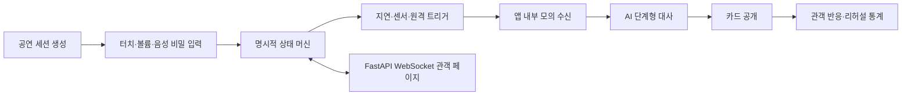

# Magic Caller AI

비밀 카드 입력과 단계형 AI 연출을 결합한 참여형 디지털 마술 플랫폼입니다. 실제 전화 발신, 통화 기록, 연락처 또는 시스템 전화 UI를 사용하지 않습니다.

> AI가 마술을 대신하는 것이 아니라, 마술사의 연출과 관객 경험을 강화합니다.

## 사용자 흐름



서버나 API 키가 없어도 로컬 `TemplateDialogueGenerator`와 Demo Mode로 핵심 시연이 가능합니다. AI 공급자는 `DialogueGenerator` 인터페이스 뒤에서 교체하며, 실패·시간 초과·비정상적으로 긴 결과는 안전한 템플릿으로 대체합니다.

## 기능

- 표준 52장과 빨강/검정 조커, 통일된 short code (`AS`, `7S`, `JR`, `JB`)
- 화면을 보지 않는 스와이프(무늬) + 탭(숫자) 입력과 햅틱
- 즉시/지연/화면 뒤집기/포그라운드 볼륨 버튼 트리거
- 진동·벨소리를 포함한 앱 내부 전체화면 수신 연출 및 카드 공개
- DataStore 공연 설정
- Firebase 익명 인증 + Realtime Database 기반 두 기기 원격 전송과 중복 소비 방지
- FastAPI 서버를 통한 실제 Instagram Story/피드 카드 공개(공식 Content Publishing API)
- Magic Lab: 일회용 QR, 실제 알림, TTS 음성 공개, 거짓말 탐지기, 사진 합성, 다중 관객
- 오프라인 Demo Mode 3종, 단계형 AI 통화, 명시적 공연 상태 머신
- 볼륨 UP=무늬/볼륨 DOWN=값 조합 및 자연어 음성 암호 파서
- 리허설 랜덤 출제, 정확도·평균 입력시간 통계
- FastAPI 단기 세션, 관객 WebSocket 메시지와 이모지 반응, 중복 명령 방지
- Firebase가 없어도 로컬 기능 정상 동작

## 기술과 구조

Kotlin, Jetpack Compose, Material 3, MVVM, Coroutines, DataStore, Firebase Authentication/Realtime Database를 사용합니다. 최소 API 26, Target/Compile SDK 35입니다. 소스는 작은 프로젝트에서 탐색하기 쉽도록 모델, 저장소, 입력·센서, ViewModel, UI로 나뉘며 요구된 각 책임(`PlayingCard`, `SettingsRepository`, `GestureInputManager`, 센서/원격/수신 제어)은 독립 클래스 또는 ViewModel 동작으로 구현되어 있습니다.

## Android Studio 실행

1. Android Studio에서 이 폴더를 엽니다.
2. SDK Manager에서 Android SDK Platform 35와 Build Tools를 설치합니다.
3. Gradle JDK를 Android Studio 내장 JDK 17 이상으로 지정합니다.
4. Sync 후 `app` 구성을 API 26 이상 기기에서 실행합니다.

`google-services.json`이 없으면 Google Services 플러그인을 적용하지 않습니다. 직접 선택과 제스처 공연은 그대로 사용할 수 있습니다.

## Demo Mode

홈의 **Demo Mode**는 네트워크와 API 키 없이 동작합니다.

- 데모 1: 스페이드 7 / 터치 / 5초 / 멘탈리스트 / 검정·금색
- 데모 2: 하트 퀸 / 볼륨 / 뒤집기 / 유쾌한 스타일 / 네온
- 데모 3: 클럽 A / 음성 암호 / 즉시 / 신비로운 스타일 / 클래식

볼륨 조합 입력은 설정에서 활성화한 동안 앱이 포그라운드일 때만 키 이벤트를 소비합니다. 접근성 서비스를 사용하지 않으며 제조사·오디오 정책에 따라 키 이벤트 전달이 다를 수 있습니다. 음성 암호 파서는 원본 오디오를 저장하지 않는 순수 텍스트 해석 계층이며, 실제 SpeechRecognizer 연결 전에도 단위 테스트할 수 있습니다.

## 공연 상태와 복구

`CREATED → READY → WAITING_FOR_SECRET_INPUT → CARD_SELECTED → TRIGGER_SCHEDULED → INCOMING → CONNECTED → REVEALING → COMPLETED` 전이를 `PerformanceStateMachine`이 검사합니다. 잘못된 전이는 거부됩니다. DataStore에는 장기 설정이 저장되며, 진행 세션 영속화와 Room 기반 전체 공연 기록은 현재 알려진 제한사항입니다.

## 관객용 WebSocket 세션

`POST /api/v1/sessions`로 기본 10분짜리 난수 세션을 만들고 `/audience/{code}`를 공유합니다. `/ws/sessions/{code}`는 공연 메시지를 전달하며, `POST /api/v1/sessions/{code}/commands`의 `Idempotency-Key`가 같은 명령의 재실행을 막습니다. 관객은 개인정보 없이 이모지 반응을 보낼 수 있습니다.

## 개인정보와 안전

- `READ_CALL_LOG`, 연락처, 실제 발신, Telecom 권한을 요청하지 않습니다.
- 수신 화면과 AI 통화 화면에는 공연용 모의 화면임을 계속 표시합니다.
- 앱은 관객 비밀번호, 계정 정보나 생체정보를 수집하지 않습니다.
- API 키와 서버 토큰은 환경변수 또는 로컬 빌드 속성만 사용하며 Git에 포함하지 않습니다.
- 화면 캡처는 `docs/screenshots/`에 추가할 수 있습니다.

해커톤 발표 원고와 체크리스트는 [`docs/hackathon-pitch.md`](docs/hackathon-pitch.md)에 있습니다.

## Firebase 연결 (처음 사용자)

1. Firebase Console에서 프로젝트를 만들고 Android 앱 `com.cardcaller.magic`을 추가합니다.
2. 내려받은 `google-services.json`을 `app/google-services.json`에 놓습니다. 이 파일은 `.gitignore`에 포함됩니다.
3. Authentication → Sign-in method에서 **Anonymous** 로그인을 켭니다.
4. Realtime Database를 만들고 원하는 리전을 선택합니다.
5. Database의 Rules 탭에 [`firebase-database-rules.json`](firebase-database-rules.json)을 붙여 넣고 게시합니다.
6. 앱을 다시 빌드합니다. Kotlin 소스에 URL이나 API 키를 직접 넣지 마세요.

예시 규칙은 인증 사용자, 6자리 방, 24시간 이내 방만 읽게 하는 시작점입니다. 실제 배포에서는 참여 토큰을 추가하고 Cloud Functions 또는 서버 작업으로 만료 방을 삭제하는 것을 권장합니다. 현재 클라이언트 생성 시각은 신뢰 경계가 아니므로 높은 보안이 필요한 환경에는 서버 검증이 필요합니다.

## 두 휴대폰 연결

1. 두 기기에 같은 Firebase 연결 빌드를 설치합니다.
2. 공연폰: 원격 카드 전송 → **6자리 방 만들기**.
3. 리모컨폰: 표시된 코드 입력 → **방 연결**.
4. 리모컨폰에서 카드 선택 및 전송.
5. 공연폰이 새 `messageId`를 한 번만 소비하고 설정된 지연 뒤 수신 화면을 엽니다.

## 제스처

- 위 ♠ / 오른쪽 ♥ / 아래 ♣ / 왼쪽 ♦
- 탭 1회=A, 2~10회=2~10, 11=J, 12=Q, 13=K
- 길게 누르면 초기화됩니다. 민감도와 결과 숨김은 공연 설정에서 바꿉니다.

## 테스트와 APK

Windows: `gradlew.bat test`, `gradlew.bat lint`, `gradlew.bat assembleDebug`  
macOS/Linux: `./gradlew test`, `./gradlew lint`, `./gradlew assembleDebug`

APK는 `app/build/outputs/apk/debug/app-debug.apk`에 생성됩니다.

## Instagram 공개 서버

Android 앱은 서버에 JSON 본문 `{ "cardId": "HEARTS_ACE", "publishType": "STORY" }`만 전송합니다. 재시도 중복 방지를 위한 UUID는 `Idempotency-Key` 헤더로 보내며 Instagram 토큰, Meta 앱 비밀키, 저장소 키는 앱에 포함하지 않습니다.

서버 처리 순서는 다음과 같습니다.

1. `requestId`를 SQLite에 원자적으로 등록합니다.
2. Story는 1080×1920, 피드는 1080×1350 JPEG 이미지를 만듭니다.
3. 운영 모드에서는 S3 호환 저장소에 업로드하여 공개 HTTPS `image_url`을 만듭니다.
4. `/{ig-user-id}/media`로 컨테이너를 생성합니다. Story는 `media_type=STORIES`를 지정합니다.
5. `/{container-id}?fields=status_code,status`를 `FINISHED`까지 확인합니다.
6. `/{ig-user-id}/media_publish`를 호출하고 게시 미디어의 `permalink,timestamp`를 조회합니다.
7. `mediaId`, `permalink`, `createdAt`을 SQLite에 저장합니다.

Meta 설정 전에는 기본 `INSTAGRAM_MODE=mock`이 실제와 같은 전체 흐름을 실행합니다.

### FastAPI 실행

Python 3.11 이상에서:

```bash
cd server
python -m venv .venv
# Windows: .venv\Scripts\activate
# macOS/Linux: source .venv/bin/activate
pip install -r requirements.txt
copy .env.example .env  # macOS/Linux: cp .env.example .env
uvicorn app.main:app --reload --host 0.0.0.0 --port 8000
pytest -q
```

에뮬레이터의 기본 서버 주소는 `http://10.0.2.2:8000`입니다. 다른 주소는 빌드할 때 지정합니다.

```bash
./gradlew assembleDebug -PCARD_CALLER_API_BASE_URL=https://api.example.com
```

운영 APK와 서버 사이에는 HTTPS를 사용하세요. Manifest의 cleartext 허용은 로컬 에뮬레이터 개발용이며 배포 변형에서는 비활성화하는 것을 권장합니다.

### Meta 및 Instagram 준비

이 프로젝트는 비밀번호 입력, Instagram 화면 자동 조작, 크롤링 또는 비공식 로그인 API를 사용하지 않습니다. Meta의 공식 **Instagram API with Instagram Login**과 Content Publishing API만 사용합니다.

1. Instagram 앱에서 계정을 Professional(비즈니스 또는 크리에이터) 계정으로 전환합니다.
2. [Meta for Developers](https://developers.facebook.com/)에서 Business 유형 앱을 만들고 Instagram 제품/API를 추가합니다.
3. Instagram Login 설정에 OAuth Redirect URI, Deauthorize callback, Data deletion callback을 등록합니다.
4. 앱 개발 중에는 대상 Instagram 계정을 앱 역할/테스터로 추가하고 계정에서 초대를 수락합니다.
5. Instagram Login OAuth에서 `instagram_business_basic`과 `instagram_business_content_publish` 권한을 요청합니다. 기존 Facebook Login 방식에서는 앱 구성에 따라 `instagram_basic`, `instagram_content_publish`, Page 관련 권한 및 연결된 Facebook Page가 필요할 수 있으므로 한 로그인 방식을 섞지 마세요.
6. 외부 일반 계정에 배포하려면 Meta App Review에서 필요한 권한의 Advanced Access를 승인받고 앱을 Live 모드로 전환합니다.
7. 서버에서 OAuth callback을 구현하거나 Meta가 제공하는 테스트 도구로 장기 토큰을 발급한 뒤 서버의 비밀 저장소에만 보관합니다. Android 앱이나 Git 저장소에 토큰을 넣지 마세요.
8. 공개 읽기가 가능한 S3/Cloudflare R2 등 HTTPS 저장소를 준비합니다. Meta 서버가 인증 쿠키 없이 이미지 URL을 다운로드할 수 있어야 합니다.
9. `.env.example`을 복사해 아래 운영 값을 설정합니다.

```dotenv
INSTAGRAM_MODE=live
INSTAGRAM_ACCESS_TOKEN=...
INSTAGRAM_USER_ID=...
INSTAGRAM_USERNAME=your_professional_account
INSTAGRAM_PROFILE_URL=https://www.instagram.com/your_professional_account/
META_GRAPH_VERSION=v23.0
APP_SECRET=...
PUBLIC_MEDIA_BASE_URL=https://cdn.example.com/card-caller
S3_BUCKET=...
S3_REGION=...
S3_ENDPOINT_URL=https://...   # AWS S3는 비워도 됨
S3_ACCESS_KEY_ID=...
S3_SECRET_ACCESS_KEY=...
```

토큰 수명과 권한은 Meta Access Token Debugger로 확인하고, 토큰 갱신·폐기 정책을 운영 환경에 추가하세요. API 버전은 Meta 지원 일정에 맞춰 검증 후 올려야 합니다.

### 모의 API 확인

`.env`에서 `INSTAGRAM_MODE=mock`을 유지하면 Meta 계정이나 S3 없이 테스트할 수 있습니다.

```bash
curl -X POST http://localhost:8000/api/v1/publish \
  -H "Content-Type: application/json" \
  -H "Idempotency-Key: demo-request-1" \
  -d '{"cardId":"HEARTS_ACE","publishType":"STORY"}'
```

같은 멱등 키를 다시 보내면 기존 결과를 반환하여 중복 게시하지 않습니다.

## Magic Lab

홈의 **Magic Lab**에서 모든 추가 마술을 실행합니다. 각 화면 위쪽의 연습/공연 모드를 전환할 수 있습니다. 공연 모드에서는 설정된 비밀 카드와 강제 결과가 관객에게 보이지 않습니다. 모든 기능은 직접 선택, 비밀 제스처, Firebase 원격 수신이 공유하는 마지막 입력 카드를 사용합니다.

### QR 카드 예언

1. FastAPI 서버를 실행하고 Android 빌드의 `CARD_CALLER_API_BASE_URL`을 서버 주소로 설정합니다.
2. 실제 관객 휴대폰이 접근할 주소를 서버 `.env`의 `PUBLIC_APP_BASE_URL`에 지정합니다. 같은 Wi‑Fi에서는 LAN 주소, 외부 공연에서는 HTTPS 도메인이나 안전한 터널을 사용합니다.
3. 카드 입력 전 **새 일회용 QR 만들기**를 누르면 스캔 페이지에 “예언을 준비하고 있습니다”가 표시됩니다.
4. 나중에 카드를 입력하고 **현재 카드 설정**을 누르거나, 카드를 먼저 입력한 뒤 QR을 만듭니다.
5. 공개 페이지는 카드가 준비된 이후 첫 정상 조회에서만 카드를 공개합니다. 이후에는 소비 완료 화면을 표시하며, 설정된 1~30분 만료 시간도 적용됩니다.

QR에는 6자리 방 코드와 `secrets.token_urlsafe`로 만든 토큰이 들어갑니다. 토큰은 앱 비밀키가 아니며 각각의 예언에만 유효합니다. 운영 `PUBLIC_APP_BASE_URL`은 HTTPS여야 합니다.

### 알림 카드 예언

알림 제목과 내용을 입력하고 `%CARD%`를 카드가 들어갈 위치에 사용합니다. 즉시, 3초, 5초, 10초 또는 0~60초 사용자 지정 지연을 선택할 수 있습니다. WorkManager가 실제 Android 알림을 예약합니다. Android 13 이상에서는 최초 실행 시 `POST_NOTIFICATIONS` 권한을 요청합니다. Android 12 이하에서는 별도 런타임 알림 권한이 필요하지 않습니다.

### 음성 전화 공개

공연 설정에서 **수신 후 카드 읽기**를 켜고 한국어/영어, 0.5~1.8배 속도, 0~10초 공개 전 대기를 설정합니다. 앱 내부 가짜 수신 화면에서 수신 버튼을 누르면 공개 화면으로 이동한 뒤 Android TTS가 선택 카드를 읽습니다. 기기에 선택 언어의 TTS 음성 데이터가 설치되어 있어야 합니다.

### 거짓말 탐지기 마술

관객이 색상·무늬·숫자 질문에 예/아니요로 답하면 스캔 애니메이션과 햅틱이 실행됩니다. 답변은 실제 생체정보나 진실 여부를 측정하지 않으며 결과는 마술사가 미리 입력한 카드입니다. 화면에도 공연용 시뮬레이션임을 명시합니다.

### 사진 속 카드 출현

시스템 사진 선택기 또는 카메라로 사진을 가져오고 카드의 가로/세로 위치, 크기, 회전, 투명도, 그림자를 조절합니다. 미리보기는 Crossfade로 전환됩니다. **기기에 저장**은 `Pictures/CardCaller`에 JPEG를 만들고, 저장 후 **공유**로 Android 공유 시트를 엽니다. Android 9 이하에서는 외부 저장소 권한이 기기 정책에 따라 필요할 수 있습니다.

### 다중 관객 모드

관객 이름을 입력할 때마다 별도의 6자리 방과 일회용 QR이 생성됩니다. 현재 입력 카드를 각 관객에게 독립적으로 지정하며 **상태 새로고침**으로 대기/공개 상태를 확인합니다. 서버 트랜잭션이 먼저 소비된 토큰의 재공개를 막습니다. 대규모 공연에서는 주기적 상태 폴링과 Redis/PostgreSQL로의 저장소 교체를 권장합니다.

### Magic Lab 제한사항

- QR 공개 서버는 관객 휴대폰에서 접근 가능해야 하며 `localhost`는 실제 관객 기기에서 동작하지 않습니다.
- SQLite는 단일 서버 공연에 적합합니다. 다중 서버 배포는 공유 데이터베이스와 행 잠금이 필요합니다.
- 일부 QR 스캐너나 보안 앱은 링크를 미리 조회할 수 있습니다. 중요한 공연에서는 공개 전 확인 버튼을 추가하는 방식으로 소비 정책을 조정할 수 있습니다.
- TTS 발음과 음색은 기기 및 설치된 음성 엔진에 따라 다릅니다.
- 사진 합성은 카드 심볼 기반 렌더링이며 원근 왜곡이나 자동 표면 추적은 지원하지 않습니다.

## 알려진 제한사항과 향후 개선

- 사용자 지정 지연 시각/발신자 편집 UI, 사용자 지정 시각 테마 편집기는 다음 버전에서 확장할 수 있습니다.
- 근접 센서 대신 가속도계의 뒤집기 판정을 사용합니다.
- 원격 방의 서버측 강제 만료/삭제는 Cloud Functions가 필요합니다.
- UI 계측 테스트는 에뮬레이터 또는 실제 기기가 필요합니다.
- Story 게시물은 일반 게시물처럼 영구 permalink가 제공되지 않을 수 있으므로 앱의 `Instagram에서 확인`은 연결된 프로필을 엽니다.
- 서버의 로컬 미디어 제공은 모의 개발 전용입니다. 실제 Meta 게시에는 공개 HTTPS 객체 저장소가 필요합니다.
- 향후 암호화된 참여 토큰, 연결 상태 presence, 오디오 선택, 스크린샷 기반 회귀 테스트를 추가할 수 있습니다.

## 플랫폼 저장소 구성

```text
caller/
├── app/                 # Android 앱 (안전한 이전 전 현재 위치)
├── backend/             # Python 3.12 FastAPI 플랫폼 API
├── reveal-web/          # React + TypeScript 관객 공개 화면
├── firebase/            # RTDB 보안 규칙과 설정 안내
├── infrastructure/      # Nginx 설정
├── docs/                # 아키텍처와 해커톤 발표 자료
└── docker-compose.yml
```

Android 소스는 기존 미커밋 변경과 Gradle `:app` 참조를 보존하기 위해 이번 단계에서 물리적으로 이동하지 않았습니다. 안전한 이전 절차는 [`docs/architecture.md`](docs/architecture.md)에 기록했습니다.

### 플랫폼 로컬 실행

1. 루트 `.env.example`을 `.env`로 복사합니다. 실제 토큰은 커밋하지 않습니다.
2. `docker compose up --build`를 실행합니다.
3. 통합 진입점 `http://localhost:8080`, OpenAPI `http://localhost:8080/docs`를 엽니다.
4. Android는 `-PCARD_CALLER_API_BASE_URL=http://10.0.2.2:8080`으로 빌드합니다.

개별 Backend 실행:

```bash
cd backend
python -m venv .venv
pip install -r requirements.txt
alembic upgrade head
uvicorn app.main:app --reload --port 8000
pytest
ruff check .
mypy app
```

개별 Web 실행:

```bash
cd reveal-web
npm install
npm run dev
npm test
npm run lint
npm run build
```

Firebase는 익명 인증, Realtime Database, Cloud Messaging을 활성화하고 [`firebase/database.rules.json`](firebase/database.rules.json)을 배포합니다. Meta 운영 환경은 Professional Instagram 계정, Content Publishing 권한, Webhook URL/검증 토큰, 서버 전용 장기 액세스 토큰과 앱 비밀값을 설정해야 합니다.

플랫폼 API:

- `POST /api/v1/sessions`
- `POST /api/v1/sessions/{sessionId}/commands`
- `GET /api/v1/sessions/{sessionId}/status`
- `POST /api/v1/reveals`
- `GET /api/v1/reveals/{token}`
- `POST /api/v1/instagram/publish`
- `GET /api/v1/instagram/publish/{requestId}`
- `POST /api/v1/instagram/webhook`
