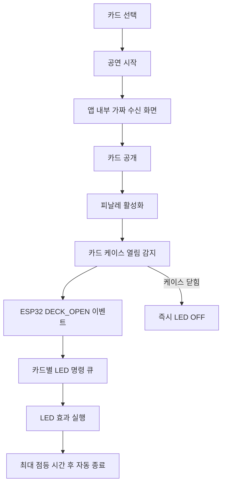
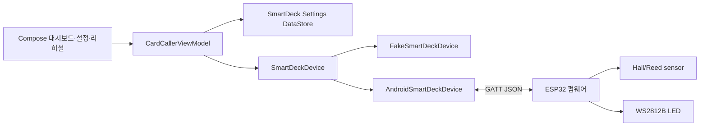

# Smart Deck 아키텍처

Smart Deck은 일반 ESP32, 홀 센서 또는 리드 스위치, WS2812B를 사용하는 독립 공연 보조 장치다. 앱과 펌웨어는 저장소 안에서 정의한 JSON BLE 규격으로만 결합되며 특정 상용 제품의 이름·로고·회로·콘텐츠를 사용하지 않는다.

## 공연 흐름

## 구성요소

`SmartDeckDevice`가 상태 `StateFlow`, 이벤트 `Flow`, 검색·연결·명령 메서드를 통일한다. Fake와 실제 BLE 구현은 ViewModel 및 UI에서 교환 가능하다. GATT UUID는 Android `BuildConfig` Gradle 속성과 펌웨어 `config.h`에 분리한다.

## 상태와 메시지

상태는 `DISCONNECTED`, `SCANNING`, `CONNECTING`, `CONNECTED`, `ARMED`, `DECK_CLOSED`, `DECK_OPEN`, `LED_ON`, `LED_OFF`, `ERROR`이다. 공연 화면은 오류 코드를 숨기고 일반 상태만 표시하며 리허설/개발 화면만 진단 코드를 표시한다.

앱 명령은 `LED_ON`, `LED_OFF`, `EFFECT`, `ARM`, `DISARM`, `GET_STATUS`, 안전 점등 상한을 동기화하는 `SET_MAX_ON`이다. 장치는 `DECK_OPEN`, `DECK_CLOSED`, `LED_STATE`, `DEVICE_STATUS`, `ERROR`를 보낸다. Android GATT 작업은 단일 큐에서 write callback을 확인한 뒤 다음 명령으로 진행한다. 잘못된 JSON은 폐기하거나 `BAD_COMMAND`로 응답한다. 앱은 동일 센서 이벤트를 200ms 동안 무시하고 펌웨어도 200ms 안정 상태 후 이벤트를 확정한다.

## 안전 설계

- 연결이 끊기거나 명령 오류가 발생하면 펌웨어와 앱 모두 LED OFF를 우선한다.
- 기본 연속 점등은 30초, 사용자 설정 상한은 120초다.
- 배터리 15% 미만이면 앱과 펌웨어가 밝기를 최대 35%로 제한한다.
- 미연결 독립 모드에서는 케이스가 열릴 때 기본 파란 LED가 켜지고 닫히거나 안전 시간이 지나면 꺼진다.
- 10분간 연결·센서·버튼 입력이 없으면 LED를 끄고 deep sleep에 들어간다.
- BLE 권한은 Smart Deck 설정 화면에서 실제 장치를 검색할 때만 요청한다.

## 남은 하드웨어 검증

소프트웨어/Fake 흐름과 메시지 계약은 자동 테스트할 수 있다. 실제 장치에서는 센서 극성, GPIO33 wake 동작, 분압 비율, LED 전원 안정성, 배터리 보호 회로, 공연 장소 BLE 거리 및 Android 제조사별 재연결 동작을 확인해야 한다.
