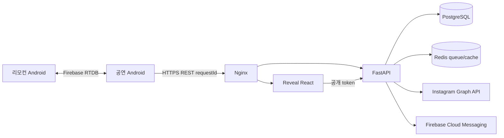
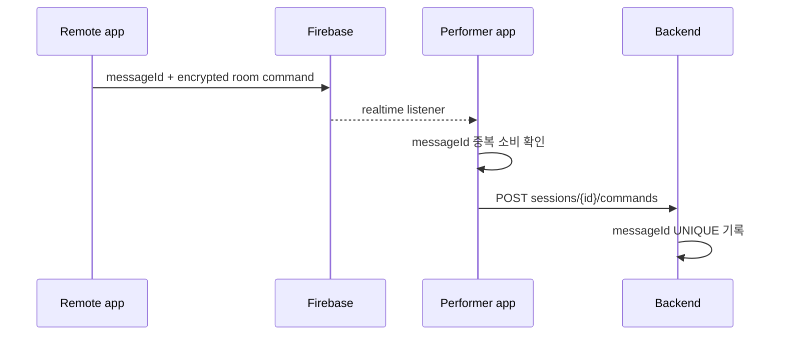
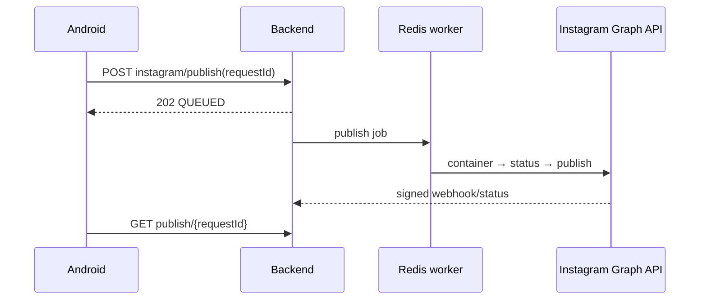
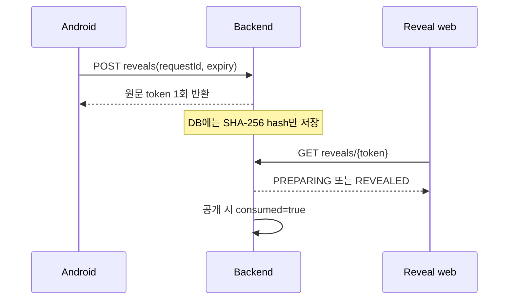

# Magic Caller AI 시스템 아키텍처

## 구성요소

- **Android app (현재 루트 `app/`)**: 오프라인 카드 입력과 전화·알림·TTS 연출, Firebase 실시간 리모컨
- **backend**: FastAPI, SQLAlchemy 2, Alembic, PostgreSQL, Redis 연결 설정, Instagram/QR/공연 상태
- **reveal-web**: 모바일 우선 React/TypeScript 일회용 공개 화면
- **Firebase**: 방 멤버십 기반 Realtime Database 규칙과 FCM 전달 채널
- **Nginx**: 웹/API 단일 진입점과 1차 요청 제한

## 원격 카드 전송

## Instagram 게시

개발 모드는 FastAPI `BackgroundTasks`와 `MockInstagramPublisher`를 사용합니다. 운영에서는 같은 job 계약을 Redis worker로 교체하고 제한된 지수 백오프와 dead-letter 처리를 적용합니다.

## QR 공개

## 데이터와 보안

`users`, `performance_sessions`, `card_commands`, `reveal_tokens`, `instagram_publishes`, `audit_events`를 초기 Alembic 마이그레이션에서 생성합니다. QR 원문은 저장하지 않으며 CORS allowlist, Nginx와 앱 미들웨어 요청 제한, Meta HMAC-SHA256 서명 검증을 적용합니다. 감사 로그에는 토큰 및 공개 전 카드값을 기록하지 않습니다.

장애 시 Android 직접 선택·제스처·모의 전화는 로컬로 계속 작동합니다. Instagram 실패 시 새 QR reveal을 만들 수 있고 Firebase listener는 기존 retry flow로 재연결합니다. 운영 배포는 TLS 종료 로드밸런서 → Nginx → backend/web, 관리형 PostgreSQL·Redis, Secret Manager 구성을 권장합니다.

## 안전한 Android 이동 계획

현재 Gradle은 루트 `settings.gradle.kts`에서 `:app`을 직접 포함하고 미커밋 사용자 변경이 존재합니다. 따라서 이번 변경에서는 이동하지 않았습니다. 변경사항을 먼저 커밋한 다음 별도 커밋에서 `app`, Gradle wrapper와 루트 Gradle 파일을 `android-app/`으로 이동하고 CI 작업 디렉터리를 함께 수정해야 합니다.
